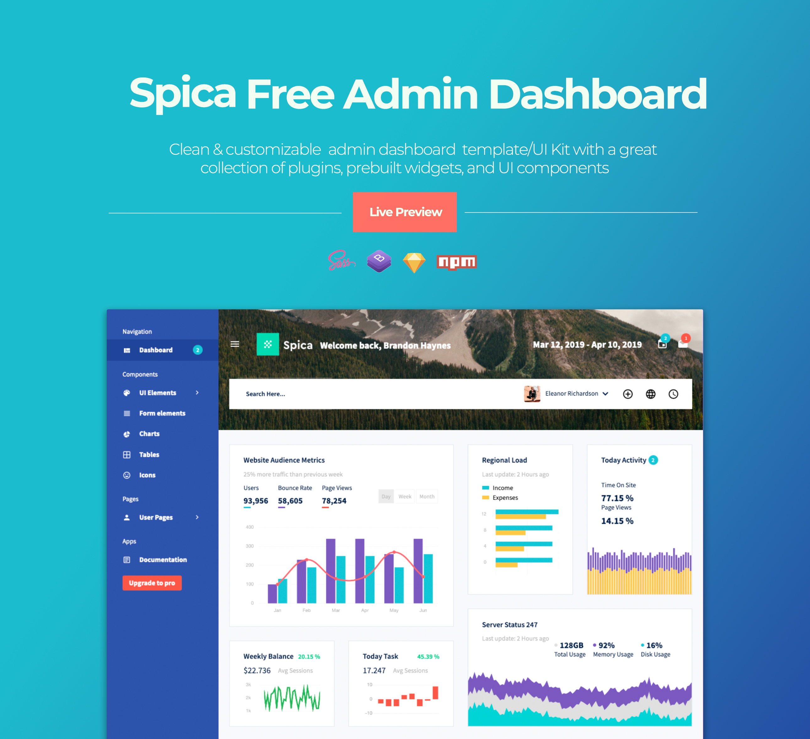

# SpicaAdmin-Free-Bootstrap-Admin-Template

Spica Admin is a simple yet powerful free Bootstrap admin template that is built with the Bootstrap framework, SASS, jQuery, HTML5, and CSS. The spectacular design, user friendliness, and easy to customizability of Spica Admin makes it suitable for building different types of admin websites. This well documented template has high responsiveness to make websites look great on both desktop and mobile devices.

The wide array of useful Dashboard elements and other essential features available with this template will make the process of website creation and customization a lot simpler. The clean and well-written code of Spica Admin Template is easy to comprehend even for beginners.

Take a quick glance at the preview of Spica Admin template [here](http://www.bootstrapdash.com/demo/spica-free/template/index.html)

<h2>How to use </h2>

<ul>
  <li>
    Download or Clone the repositary
  </li>
  <li>
    Open the file template/index.html in a browser to view the demo
  </li>
  <li>
    Start editing the code as per your requirement
  </li>
  <li>
    If you wish to customize the template, use the command 'npm install' to install the necessary dependencies. Refer <a href="http://www.bootstrapdash.com/demo/spica-free/template/docs/documentation.html">documentaion</a> for more details on customization.
  </li>
</ul>
